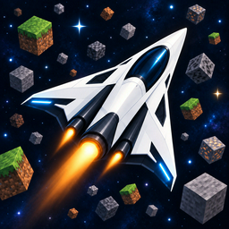

# Astra MWE

**Minecraft World Exporter · v0.1.0 · [Русский](README.md) · MIT**

**Astra MWE is not a production-ready exporter; it is a proof of concept.** The project explores exporting Minecraft Java 1.13+ worlds to GLB as an alternative to OBJ- and USD-based workflows. Version 0.1.0 is intended for practical experimentation and may still have incomplete mod support, rendering differences and performance limitations. Compatibility with every version or resource pack is not guaranteed.

The program was created entirely with ChatGPT using **GPT-6 Astra** at **high** reasoning effort.

Go core, Wails desktop shell, Three.js/WebGL2 preview. Worlds are read only. Minecraft files and skins are not distributed with the application.

## Quick start

1. Extract the archive and run the executable for your platform. Windows requires Microsoft Edge WebView2 Runtime; Linux GUI requires GTK3 and WebKitGTK 4.1.
2. Open a detected world or select its folder / `level.dat`.
3. Select the matching Minecraft client JAR. Add mod JARs and resource packs; lower entries override earlier ones.
4. Select an area in the top-down view or enter coordinates. Export geometry and height rebuild automatically.
5. Choose a new GLB filename and export. Existing files are not overwritten.
6. Import using Blender's File → Import → glTF 2.0. Use Dithered for fractional transparency in Blender materials.

The world is one mesh object with separate block materials and original texture filenames. Textures are not atlased. Players are separate objects. GLB retains fractional alpha; Dithered is a Blender setting, not a glTF alpha mode.

## Features and controls

- Dark desktop interface. UI text is currently Russian; F1 opens help. Settings are session-only.
- Parallel tile generation and background GLB decoding. Optimized 3D preview extends 128 blocks / eight chunks beyond each side of the selection, subject to a memory budget. Very large selections use a central 256×256 preview core; export bounds remain independent.
- Viewport-driven 2D map, detailed texture pixels at close zoom, player face markers.
- Always-on biome tint and seven-block blending; optional hollow leaves and export mesh optimization.
- Saved player positions and NameMC skins with Mojang fallback, then Steve if unavailable. Players remain visible when excluded from export.
- No selection area cap: large exports stream through temporary disk files. A single GLB still has the format's approximately 4 GiB limit.

| Action | Input |
|---|---|
| Orbit | Middle mouse |
| Pan | Shift + middle mouse; top-down: middle mouse |
| Zoom / dolly | Wheel / Ctrl + middle mouse |
| Select region | Left drag in top-down view |
| Frame selection | F / Numpad decimal |
| Front / right / top | Numpad 1 / 3 / 7; Ctrl reverses |
| Perspective / orthographic | Numpad 5 |
| Fly | Shift + backquote, mouse, WASD, Q/E, Shift accelerates, Esc exits |

The axis compass is clickable. Y is Minecraft height.

## Status and limitations

Windows x64 browser-mode runtime has been checked. Linux GUI and ARM64 runtime have **not** been verified. Build success is not a runtime compatibility guarantee.

JSON block models and resources are supported; arbitrary Java mod rendering code is not executed. Special block renderers, waterlogged geometry, partial fluid obstacles, CTM/CIT, shaders, PBR, animation and ordinary entities are incomplete or unsupported. Exact biome boundary noise is not reproduced. Unknown models may use a visible fallback cube. Large worlds require disk space and time; optimization does not guarantee a particular GPU load.

See [verification notes](docs/verification.md) for measured conditions and [release notes](CHANGELOG.md).

## Build

See [CONTRIBUTING.md](CONTRIBUTING.md) for the source map, ownership contracts and formatting rules (Russian).

Requires Go 1.25+, Node.js 24 and npm. Run `./scripts/build.ps1 -Architecture amd64` in Windows PowerShell, or `bash scripts/build-linux.sh amd64` on Linux. Use `arm64` on matching Linux ARM64 hardware; Windows ARM64 can be cross-built. Linux needs `build-essential pkg-config libgtk-3-dev libwebkit2gtk-4.1-dev`.

Scripts generate Windows resources and PNG/ICO icons from the supplied artwork before building. Outputs are in `build/bin/`. Test with `go test ./...`, `go vet ./...`, and `npm test` / `npm run build` in `frontend/`. CLI operates without WebView or GPU; use `-help` for arguments.

## License

[MIT](LICENSE) for Astra MWE code. [Third-party notices](THIRD_PARTY_NOTICES.txt) retain dependency licenses. Minecraft assets supplied by users retain their own rights. Artwork was provided by the project author.

References: [MiEx](https://github.com/BramStoutProductions/MiEx), [Dine](https://github.com/rezervkant-cmd/dine). This unofficial project is not affiliated with Mojang or Microsoft.
